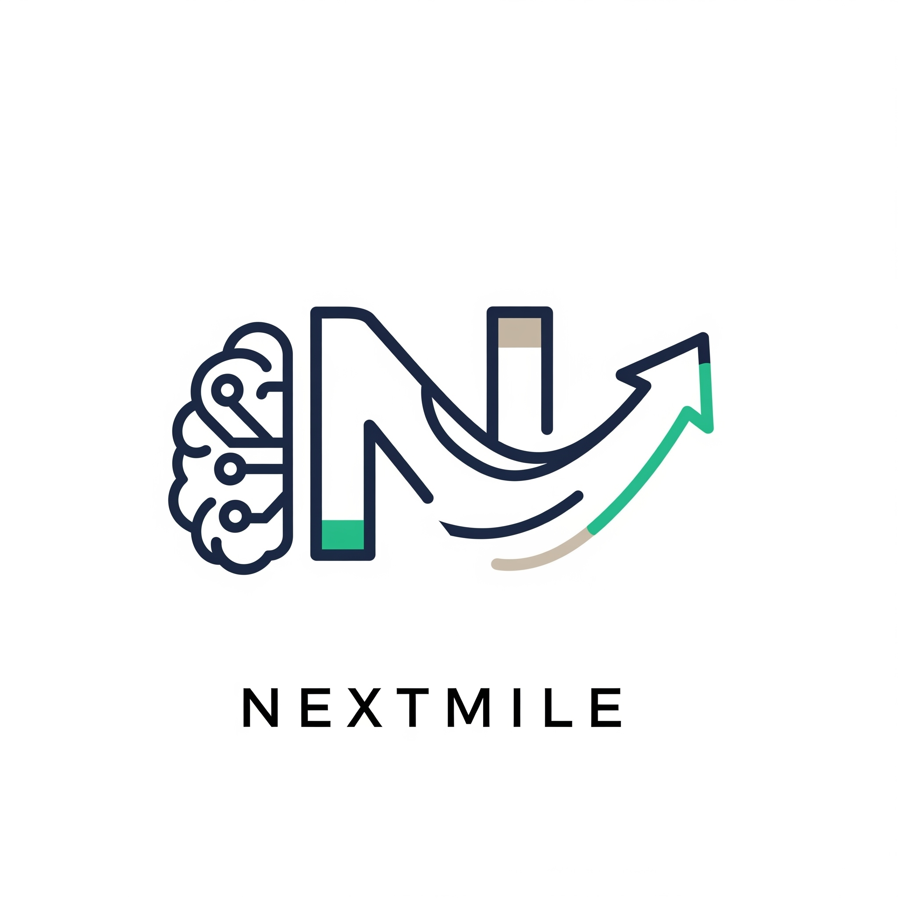

# Nextmile: Your AI-Powered Career Assistant 🚀
Nextmile is an innovative open-source resume platform powered by AI. It provides a range of services for job seekers, including personal portfolio pages, interactive resume displays, and a digital twin (RAG) assistant to help them stand out from the crowd.

  

  

✨ Key Features
Personal Portfolio Pages: Go beyond a static resume. Create a dynamic online presence that highlights your projects, skills, and unique personality.

Interactive Resume Displays: Make your application unforgettable. Present your experience in engaging, visually rich formats that captivate recruiters.

AI-powered Digital Twin (RAG) Assistant: Gain an unfair advantage. Our advanced AI assistant provides personalized feedback, helps you ace interviews, and offers tailored career advice.

Open-Source & Community-Driven: Join a transparent, continuously improving platform. Our open-source model ensures flexibility, customization, and a supportive community.

💻 Tech Stack
Nextmile is built on a modern, robust foundation, ensuring a seamless and high-performance user experience.

Frontend:

React: A component-based JavaScript library for building intuitive UIs.

Next.js: A powerful React framework enabling optimal performance with server-side rendering and static site generation.

Backend:

Node.js: A fast, scalable JavaScript runtime.

Database:

MongoDB: A high-performance NoSQL database built for scalability.

AI/ML:

Python: The core language for developing our advanced AI and Machine Learning models, including the RAG digital twin.
